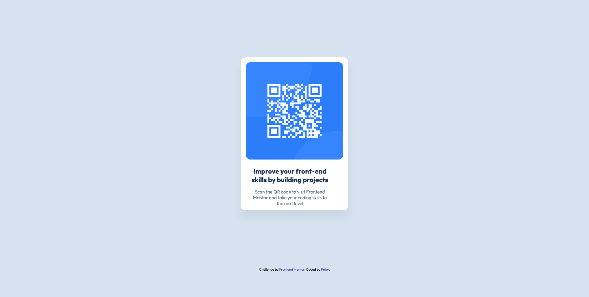

# Frontend Mentor - QR code component solution

This is a solution to the [QR code component challenge on Frontend Mentor](https://www.frontendmentor.io/challenges/qr-code-component-iux_sIO_H). Frontend Mentor challenges help you improve your coding skills by building realistic projects. 

## Table of contents

- [Overview](#overview)
  - [Screenshot](#screenshot)
  - [Links](#links)
- [My process](#my-process)
  - [Built with](#built-with)
  - [What I learned](#what-i-learned)
  - [Continued development](#continued-development)
  - [Useful resources](#useful-resources)
- [Author](#author)

**Note: Delete this note and update the table of contents based on what sections you keep.**

## Overview

### Screenshot
#### Desktop


#### Mobile


### Links

- Solution URL: [Add solution URL here](https://your-solution-url.com)
- Live Site URL: [Add live site URL here](https://your-live-site-url.com)

## My process

### Built with

- Semantic HTML5 markup
- CSS Flow layout
- Absolute position


### What I learnt

I learnt how to use absolute centring, a technique that involves horizontal and vertical centring simultaneously without using flexbox.

To see how you can use that, see below:

```html
<div class="container">
  <div class="absolute-center">
  </div>
</div>
```
```css
.container{
  position: relative
}

.absolute-center {
  position: absolute;
  inset: 0 /* top:0; bottom:0; left:0; right:0; */;
  margin: auto;
}
```

### Continued development

I will continue to learn how to organise my code more efficiently.


### Useful resources

- [CSS for JS developers](https://css-for-js.dev) - This helps me for learning CSS concepts. I really liked this course and will use it going forward.
- [Absolute centering](https://www.smashingmagazine.com/2013/08/absolute-horizontal-vertical-centering-css/) - This is an amazing article which helped me finally understand both horizontal and vertical centering without flexbox. I'd recommend it to anyone still learning this concept.


## Author

- Frontend Mentor - [@phasznos](https://www.frontendmentor.io/profile/phasznos)
- Twitter - [@phasznos](https://www.twitter.com/phasznos)
- Github  - [@phasznos](https://github.com/phasznos)
